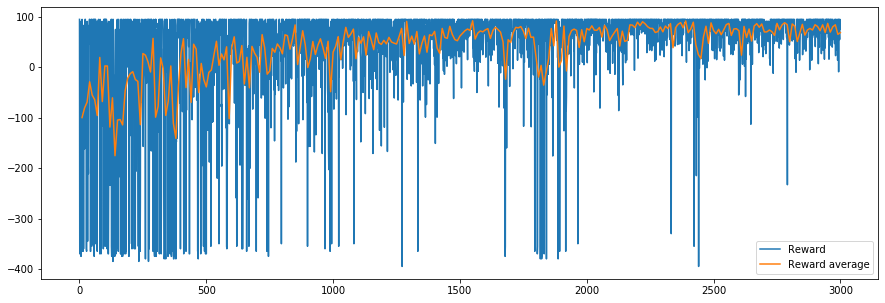

# DoomDQN
In this repositery I build a **Deep Q-Network** with Pytorch to play Doom, following the tutorial: https://www.freecodecamp.org/news/an-introduction-to-deep-q-learning-lets-play-doom-54d02d8017d8/.

The code is for building the DQN agent is visible in the notebook "DQN Agent for Doom.ipynb".

## Task

The first goal is to play a very simple scenario of the game: a monster is in the room; we can go right, left or shoot; we need to navigate in order to put the monster in front of us and shoot.

## Architecture
In order to capture movement, we stack four frames of the game to construct our state.

We use a **CNN** to analyse the frames. It's composed of three convolutional layers each followed by Batch Normalisation, one fully connected layer. A final output layer gives us the predicted Q-values for the three possible actions.

In order to reduce correlation between experiences, we use **experience replay**. We save the experiences tuple (state, action, reward, new_state) in a replay memory. After each episode, we train our DQN on a batch of experiences.

## Experiments
### DQN with simple Replay Memory
The first step was to build a simple DQN agent with experience replay. With this model, we already acheive good results on the task. We visualize them with these graphs of the Loss and the reward during training:

(Training during 3000 episodes, using a batch of 256 experiences for each learning step).

We see that in 3000 episodes, the agent manages to improve both its loss and rewards. However the training is quite noisy and the agent still perform a bit poorly during some episodes. Let's see if we can improve the training process!

## Next steps
After reaching good results on the first task, I'll continue the development of this project on more difficult tasks of the Doom environment. Following the Thomas Simonini's tutorials, I'll be implementing Dueling Double DQN, Prioritized Experience Replay, Policy Gradients, A2C and maybe more ! The goal is to create an agent that could complete the entire game of Doom... let's get to work !
